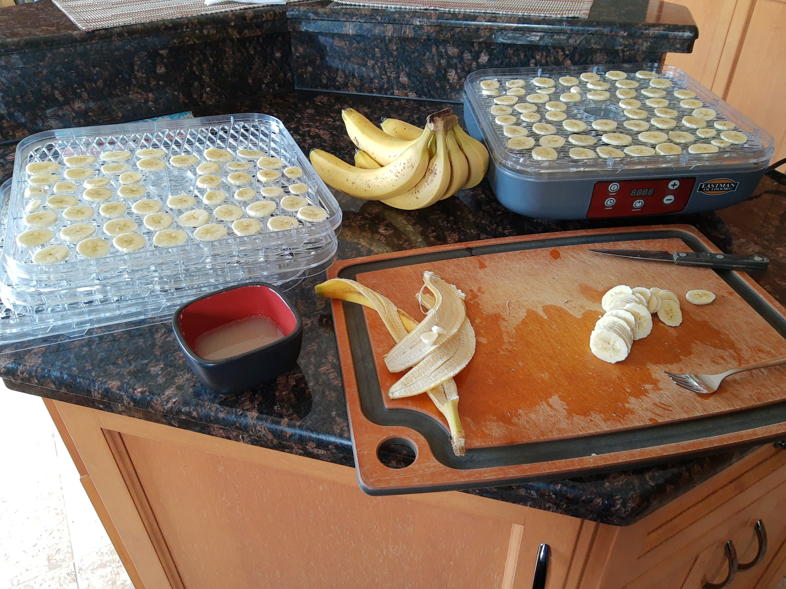
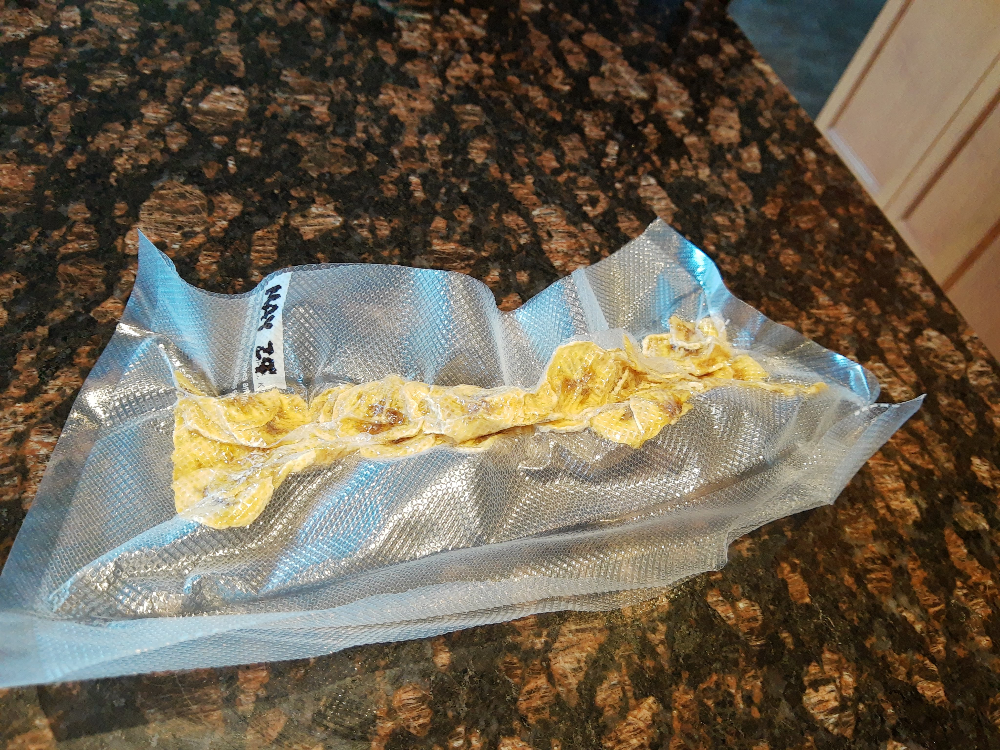

My second dehydrating project was bananas. The internet told me that I should dip each slice in lemon juice in order to prevent them from turning completely brown during the drying process. So, that part made things fairly time consuming since each banana was cut into such thin slices.

The taste and texture was pretty good right after they were done - kind of chewy and leathery, not crunchy like banana "chips".

I read that they would tend to rehydrate really quickly, so you would either need to eat them right away or prep them for longer term storage. Since we had lots of other fresh bananas in the house at the time, I didn't want to eat the dried ones immediately. So I used my vacuum sealer to package them up.

This (obviously) caused the slices within each package to become compressed together. When I opened a package a few weeks later (they were stored at room temperature), the bananas were well preserved, but the slices were basically impossible to separate. It was more or less just one ball of banana per package. I ended up just slicing them into small cubes before adding them to some cereal.

They were tasty, but really hard to chew. Next time I might try slicing the bananas lengthwise (instead of into rounds) - less prep work, and then maybe they could be vacuum sealed in a single layer.

Other details:
---
+ TOTAL DRYING TIME: 8 hrs at 135F
+ ~12 bananas made 3 vacuum sealed packages like the one shown below

