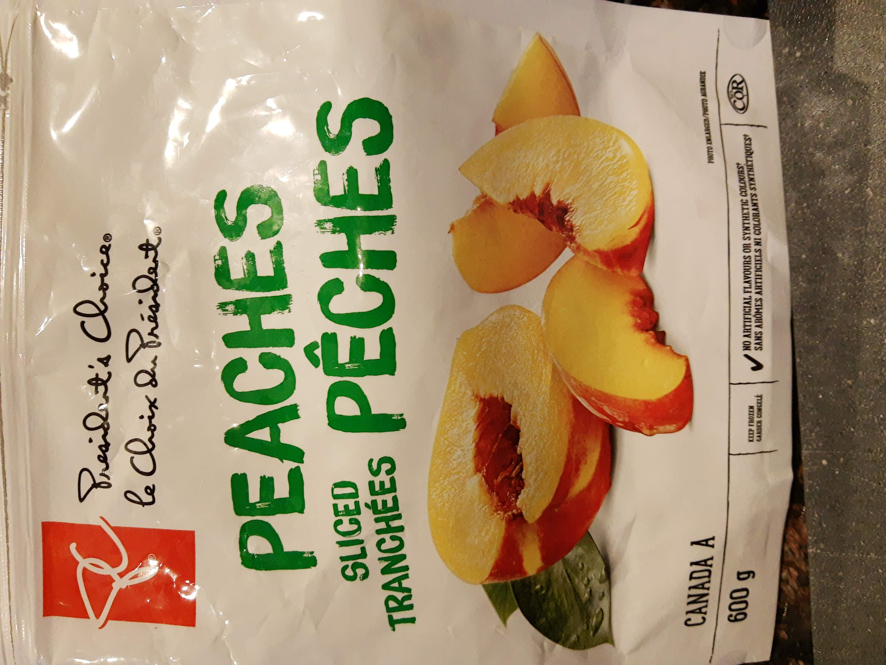

I recently bought a bag of frozen peaches. For some reason, they were absolutely awful. The texture was terrible (woody?), and the taste was worse... there was some kind of weird chemical aftertaste that we couldn't quite identify (Bergen suggested it reminded him a bit of diesel).

I also recently got a food dehydrator. As a first project, I decided to see if drying the gross peaches would make them taste better. If not, at least I got to test out my new machine.

This doesn't really qualify as a "Bergen Builds" post, but I thought I might occasionally hijack the blog to help keep track of drying times and other details as I continue to experiment with dehydrating.

TOTAL DRYING TIME: 6.5-7 hrs at 135F

Did dehydrating gross peaches make them less gross? Actually, YES! Straight from the bag they were inedible, but after drying them they were actually not bad. Good to know!

